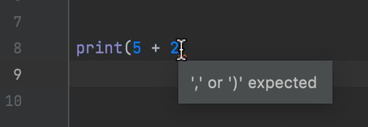
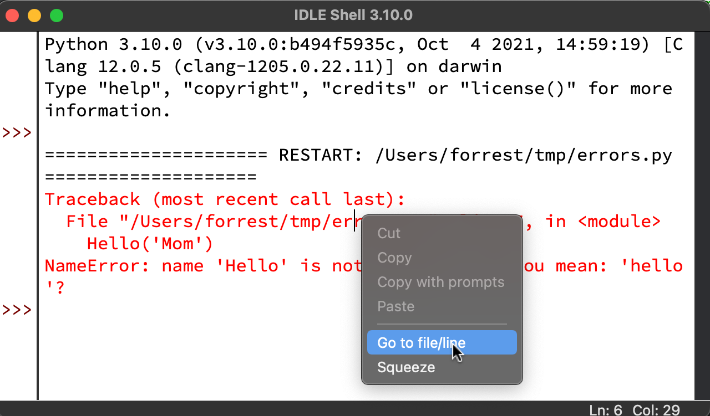

## Errors are Inevitable
The previous section demonstrated some very simple Python code statements. Hopefully, 
you successfully replicated the examples.  Once you get beyond simple statements 
you'll inevitably encounter errors. Be patient as this is common even for 
professionals with years of experience with the language. 

!!! quote
    A different error message! Finally some progress![^1]

[^1]: The most upvoted post on devRant. Via [bakablah](https://devrant.com/rants/17426/a-different-error-message-finally-some-progress)

## Errors: Two-types
The two types of error messages that you'll encounter are *syntax errors* and *runtime 
errors*. Syntax errors result from the violations of the basic rules of Python 
structure whereas runtime errors are usually the result of mistakes in the program 
logic. Naturally, we want to correct errors. Of the two, syntax errors 
are the simplest to address.

### Syntax Errors
Syntax errors are mistakes in the structure of the text of the Python source code. 
The `print()` function, for example is a Python function.  When we use the print 
function, we type the *name* of the function, followed by `(` followed by the 
expression to print, followed by `)`. 

```python
>>> print("Look ma! No errors!")
Look ma! No errors!
```

If we enter this code into the editor and leave out the last `)`, we introduce a 
syntax violation. Different editors handles this in different ways.  IDLE will not 
warn you about this until you attempt to run the code.  Let us attempt this example in 
IDLE.

- enter the following code into an editor window in IDLE
- save the file to a suitable file name (example: `errors.py`)
- run the module with "Run -> Module" (or ++F5++)

```python
print(5 + 2
```

When we enter this code in IDLE, we receive no indication of an error.  When we run 
the module, however, IDLE displays an error dialog.

<figure markdown>
{width="500"}
<figcaption>IDLE presents an error dialog for syntax errors.</figcaption>
</figure>

When we dismiss the dialog, the location of the error is highlighted in the editor 
window.Note that the location of the highlight is not *exact*, but it does provide 
enough context to make the correction. 

<figure markdown>
{width="500"}
<figcaption>IDLE highlights the location of syntax errors.</figcaption>
</figure>

!!! note
    Sometimes, a syntax error is highlighted on a different line from the actual 
    location of the actual error.  This can be misleading. A simple method in this 
    case is to inspect both the highlighted line *and* the preceding line. 

Various editors handle syntax errors in different ways. For example, PyCharm will 
automatically add the closing `)` when you enter `(`, which is helpful in avoiding 
such errors.  If we delete the closing paren while editing further, PyCharm will 
annotate the error with a red squiggle line along with a hover tooltip. 

<figure markdown>
{width="500"}
<figcaption>PyCharm annotates syntax errors as we edit.</figcaption>
</figure>

#### Syntax Errors are Caught By a Linter
Syntax errors are typically caught by a linter or similar program which inspects the 
code prior to the text being sent to the Python interpreter for execution. Many IDEs 
provide a way to customize the linter and even add additional linters to further 
inform the user as to potential syntax, style, or even logic errors prior to code 
execution. PyCharm for example provides a wealth of feedback including style error 
hints, syntax warnings, spell-checking and more--all of which are presented to the 
developer as they edit code. 


#### More Syntax Error Examples
The following Python program will be used to demonstrate more examples of syntax 
errors. Using IDLE, add copy and paste this code into a new editor window and save the 
file as `errors.py`. We can then introduce deliberate errors and inspect the syntax 
errors displayed in error dialogs. 

```python title="errors.py"
def hello(name):  #  (1)!
    """Prints 'Hello <name>' where name=<name>""" #  (2)!
    print(f'Hello {name}') #  (3)!
# (4)!

if __name__ == '__main__': #  (5)! 
    hello('Mom')  #  (6)!
```

1. This is a Python function signature--the first line in a function definition. The 
   `def` keyword starts a function definition. The name `hello` is used to call the 
   function. The formal parameter `name` is used to accept input to the function. The 
   parameter list must be enclosed in `()` and finally a semicolon `:` ends the 
   function signature. 
2. The triple-quoted string here is a *docstring*. Docstrings are useful for 
   documentation but also provide users of the function with useful help as they are 
   printed when calling `help()` a function. Docstrings should be enclosed in triple 
   double quotes--`"""`. 
3. This is the function body which happens to be a single line for this function. The 
   function body must be indented, usually with a 4 space indent. 
4. Per PEP8 guidelines, leave two blank spaces after a function definition.
5. This *main selection block* is useful for including lines of code that will run 
   when the module is run as a script.  Indented code below this line will be run when 
   your module is run in IDLE for example.
6. This indented line of code will execute when you run the module as a script 
   (Run-Run Module in IDLE). This is a call to the `hello()` function defined previously.

Here are some errors to introduce on your own to explore the various types of errors 
one can encounter. In each case, introduce the error, [run the module](../02/02-setting-up-python.md#edit-and-run-a-python-module), inspect the error dialog, and 
then 
correct the error.  

!!! tip
    Configure IDLE to display line numbers: On the toolbar select "Options -> Show Line 
    Numbers". This will demonstrate how syntax errors assist in locating some errors by 
    including line numbers. 

1. Remove a semicolon from either the function signature or the `if` statement. Run 
   the module, inspect, and correct the error.
2. Remove one of `{` or `}` from the call  `print(f'Hello {name}')`. What error is 
   displayed? 
3. Remove a single quote `'` from any of the string literals in the program. 
4. Remove the spaces before `hello('Mom')`.  What error is produced. 

#### Syntax Error Summary
Syntax errors are raised when we break the structural rules of the language. Our IDE 
will typically inform us of such errors and provide enough context clues to aid our 
corrections. Hopefully you tried out the additional syntax error examples.  It 
is good to see these now, when you are not focused on another problem. 

### Runtime Errors
Runtime errors are another type of error that you will encounter as you develop 
software. As the name implies, runtime errors occur when your program is run--at 
execution time. The majority of runtime errors are raised by the Python interpreter 
in response to a broad scope of potential problems.  The list below highlights a few 
of the sources of runtime errors:

- logic errors included in the code itself
- user errors:  incorrect values to types fed to program via web or text interface
- timeouts or connection errors when one program is communicating with another 
  (querying a web API with Python for example).

For most newcomers to the language, logic errors are the most common source of runtime 
errors.  Logic errors are a broad range of errors that we introduce into our program.  
For every type and feature of the language, there are a different set of logic errors 
we could introduce.  Here, we explore some common runtime errors experienced by new 
Python developers.

#### Name Errors
A `NameError` is raised by the interpreter when our program attempts to access a name 
that has not been defined.  A classic example of this occurs when we mistype a 
variable or function name. Python is a case-sensitive language so the names 'Hello' 
and 'hello' are different. Enter the following program into an editor window in IDLE 
and run it to explore how the Python interpreter handles such an error. 

```python title="errors.py"
def hello(name):
    """Prints 'Hello <name>' where name=<name>"""
    print(f'Hello {name}')


if __name__ == '__main__':
    Hello('Mom')  #  (1)!
```

1. This is the source of the error.  `Hello` is not the same as `hello` *and* `Hello` 
   is not defined anywhere in the module.

When you run `errors.py`, the following error is displayed by the interpreter in the 
[Python shell](../02/02-setting-up-python.md#introducing-the-python-shell). 

```python
>>>
Traceback (most recent call last):  #  (1)!
  File "/Users/forrest/tmp/errors.py", line 7, in <module>  # (2)!
    Hello('Mom')
NameError: name 'Hello' is not defined. Did you mean: 'hello'?  #  (3)!
>>>
```

1. Traceback is the first line you'll see in a simple traceback such as this. A 
   traceback traces a runtime error back to its source. 
2. There are often many such lines in a traceback.  This provides the ability to trace 
   the entire path of calls that produced the error.
3. This line names the error that was raise (here a `NameError`). Beginning with 
   Python 3.10, helpful hints are also printed on this line.

IDLE's Python shell provides a way for you to go straight from the error to the file 
and line that produced it. Right click on a line with a line number in the traceback 
and select "Goto File/Line".  This will take you directly to the location related to 
the line in the traceback.  Again, there are often multiple references to source code 
in a given traceback, so this will definitely come in handy. 

<figure markdown>
{width="500"}
<figcaption>Right-Click on a file or line number in a traceback.</figcaption>
</figure>

#### TypeError
Type errors arise when an operation is applied to an object of the wrong type. A 
classic example is the following:

```python
>>> "10" + 5
Traceback (most recent call last):
  File "<pyshell#0>", line 1, in <module>
    "10" + 5
TypeError: can only concatenate str (not "int") to str # (1)!
```

1. Here's a `TypeError` in the wild. Translated, this means we must either convert 
   `"10"` to `10` or `5` to `"5"`--depending the desired result.

Type errors are common throughout all levels of Python development.  Common examples 
include: 

* calling a function with the wrong order or type of arguments.
* arithmetic operations on mixed and incompatible types

#### ValueError
If you attempt to pass a negative value to a function that expects only positive 
values, a value error will be raised.  Classic examples that result in the raise of a 
`ValueError` are usually associated with the `math` library which is part of the 
Python standard library. Here are a couple of examples:

```python
>>> import math
>>> math.sqrt(-42)  #  (1)!
Traceback (most recent call last):
  File "<pyshell#3>", line 1, in <module>
    math.sqrt(-42)
ValueError: math domain error  #  (2)!
>>> math.log(-10)
raceback (most recent call last):
  File "<pyshell#5>", line 1, in <module>
    math.log(-10)  # (3)!
ValueError: math domain error  #  (4)!
```

1. In pure math, this would result in a complex number. Python's `cmath` library can 
   handle such values, but not the `math` library.
2. Here's that `ValueError`.  `math.sqrt` only handles positive values. 
3. Again, this would result in a complex number (or undefined in some contexts) and the 
   `math` lib does not handle such types.
4. The `ValueError` here is again related to a domain error. `math.log()` handles only 
   positive valued inputs.

#### Other Errors
Many of the errors listed below deserve a bit more context than is given at this stage 
of the book. If some of them don't make sense now, don't worry.  Specific error types 
will be covered in more detail once a related topic is introduced. The list below 
highlights some of the most common runtime errors experienced.

|Error Class| Reason|
|-----------| ------|
|`ImportError`| There was an issue loading a module with the `import` statement|
|`IndexError` | Raised when a sequence subscript is out of range.|
|`KeyError`   | Raised when a dictionary key is not found|
|`TypeError`  | Raised when an operation is applied to the incorrect data type|
|`ValueError` | Raised when a operation for function receives the correct type but incorrect value.
|`ZeroDivisionError`|Raised when an operation results in a division by zero|

#### More Complicated Tracebacks
Many of the tracebacks that you encounter will reference multiple lines of code. It 
can take a bit of practice to get used to interpreting such errors. A simple example 
will help illustrate.

```python
def hello(name):  #  (1)!
    """Prints 'Hello name'"""
    print(f'Hello {name}')


def decorate(name):  #  (2)!
    """Decorates a name with + signs"""
    return '++' + name + '++'


def decorative_hello(name):  # (3)
    """Prints 'Hello ++name++'."""
    decorated = decorate(name)
    hello(decorated)


if __name__ == '__main__':
    hello('Mom')  # (4)!
    decorative_hello(5)  # (5)!

```

1. We've seen this function in a previous example. For a call `hello('Mom')` this 
   prints `Hello Mom`.
2. This function returns a string with `++` on either side of it.  To accomplish this 
   is uses the `+` operator to put the strings together an operation called concatenation.
3. `decorative_hello()` uses the other two functions (`hello()` and `decorate()`) to 
   print a decorated name. 
4. This call will not produce an error. 
5. If you refer back to the `TypeError` section, it may help you understand why this 
   line throws an error. 

When we run the code above from IDLE, the following traceback is produced. At first 
glance we can already see that there is a bit more to digest in this error message im 
comparison to the others demonstrated on this page. The key to quickly resolving the 
source of the error is to start reading in the right place. The first line in the 
traceback provides a hint. 

The best way to read tracebacks is by starting at the bottom and working up--if needed.
The last line of source code referenced in a traceback is where the error occurred. 
This doesn't mean that this is the source of the problem. In the case of our example, 
the source of the problem is at the very top of the program, but we gain insight into 
*why* the error occurred by looking at *where* the error occurred.

In the case of this example, the first and last lines of code listed in the traceback 
are all we need to determine the fix. 

Start from the bottom of annotation on the traceback and click through each 
description for more information.
```python
Traceback (most recent call last):
  File "/Users/forrest/tmp/errors.py", line 19, in <module>
    decorative_hello(5)  #  (4)!
  File "/Users/forrest/tmp/errors.py", line 13, in decorative_hello
    decorated = decorate(name)  #  (3)!
  File "/Users/forrest/tmp/errors.py", line 8, in decorate 
    return '++' + name + '++'  #  (2)!
TypeError: can only concatenate str (not "int") to str  # (1)!
```

1. This is the error type--a `TypeError`.  This lets us know that an operation was 
   performed on the incorrect type.  In the lines above, we look for arithmetic 
   operations and function calls.
2. This is the operation that raised the `TypeError`. Here we have a string type `++`
   concatenated with the variable `name`. The result of that operation would then be 
   added to the last string type `++` except the error was raised. 
3. This is is `decorative_hello()` calling `decorate()` to concatenate the `name` 
   variable with `++`.  
4. This is the true source of the error.  `decorative_hello()` calls `decorate()` 
   which is the function where the error occurred. `decorate()` contains operations on 
   strings but is ultimately called with a number which is why the error is raised.
 


