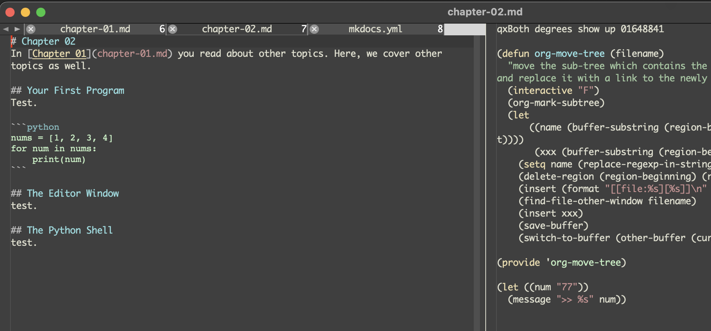

# Chapter 02
In [Chapter 01](chapter-01.md) you read about other topics. Here, we cover other topics as well.

## Your First Program
Test.

```python
nums = [1, 2, 3, 4]
for num in nums:
    print(num)
```

## The Editor Window
Here is a screenshot. How horrible does this look?



## The Python Shell
test.
