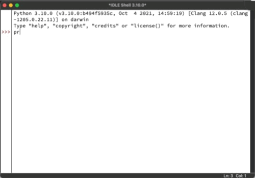

## Downloading Python
The Python version supported by this text is version **3.10.x** (note
that the `x` can be any number). When downloading Python, please be
sure to select this version.

Official Python releases are available from the official [Python
Page](https://www.python.org). The site auto detects your operating
system and provides a link to the most current version. If the target
version is not listed, you can visit the [All
Releases](https://www.python.org/downloads/) page to locate it.

## Installing Python
For installation instructions, I will lean on the expertise of the
RealPython team. This platform maintains up-to-date, community
reviewed instuctions and articles on many Python related topics.

Visit the RealPython [installation
instructions](https://realpython.com/installing-python/) for an
up-to-date guide on installing for your operating system and platform.

!!! danger "For Windows Users..."

    Do not install the Microsoft Store version of Python. Be sure to
    install the package available from the official Python page.

## Using the IDLE IDE
An IDE (intgrated development environment) typically includes:

- an editor for editing code
- a method for building / running code
- a debugger for tracing program execution and troubleshooting errors

Python programs are simply text files, so you can technically use your preferred
*plain text editor* to edit Python code. However, you will need to
rely on the operating system shell / terminal to run your code using
the Python interpreter.

An IDE simplifies your workflow when editing and running programs. For
first time Python users, IDLE is a great choice for many reasons:

- IDLE is installed when you install Python using the official
  installer.
- IDLE is preconfigured and ready to use for Python development.
- IDLE is simpler than most IDEs.

This text will refer only to IDLE when showing examples that involve
an IDE.

### Launching IDLE
Launch IDLE using your favorite launch method. On most operating
systems, the search feature is typically the fastest.

- On Windows, press the Windows key and start typing IDLE
- On macOS, type Command + SPACE and start typing IDLE

When IDLE launches, you will be greeted by a window containing the
Python shell. We'll refer to this as the "shell window" or
"interactive window".  The interactive window lets you interact with
the Python interpreter directly by entering code statements and
viewing the result.

<figure markdown>
  { width="500" }
  <figcaption>Python Shell / IDLE Interactive Window</figcaption>
</figure>

## Other IDEs

### Microsoft Visual Studio Code

### Pycharm
