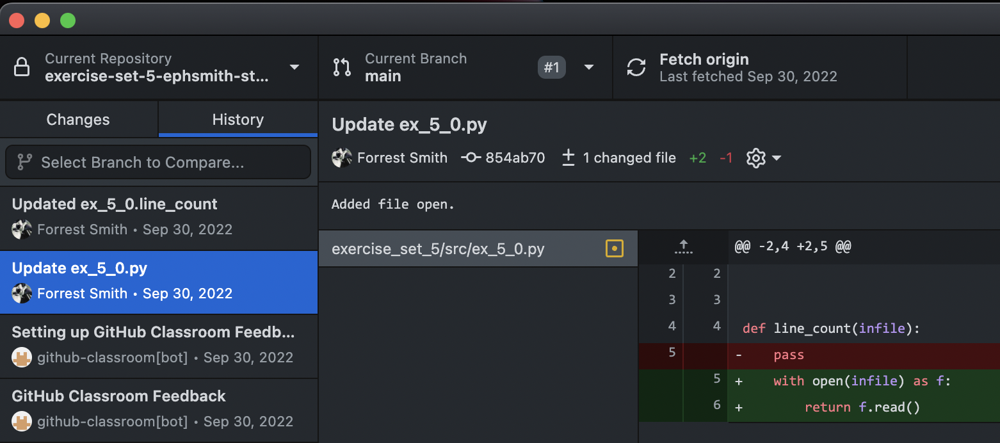
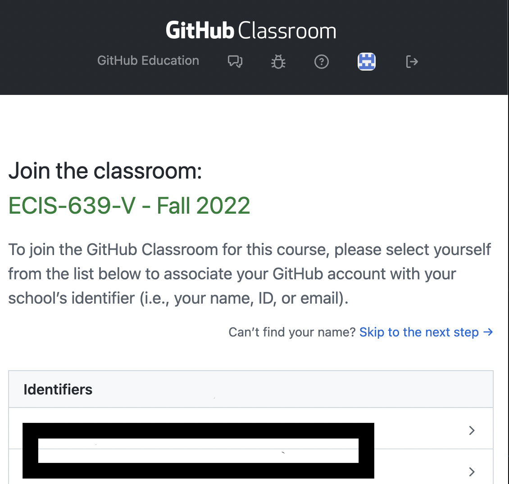
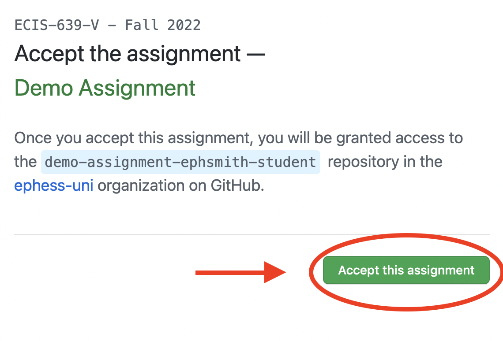
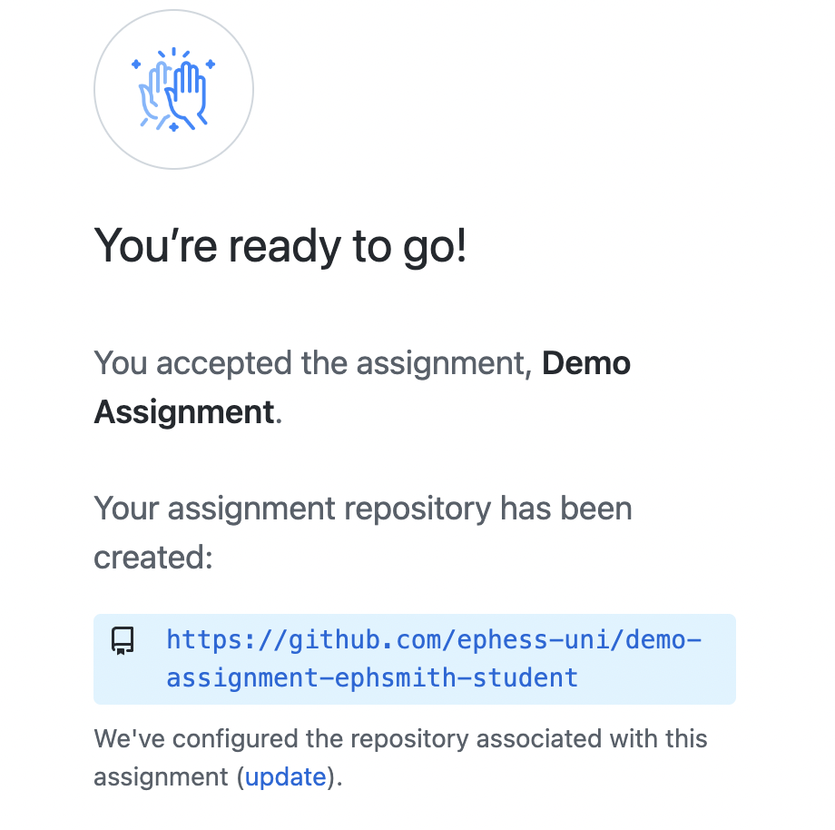
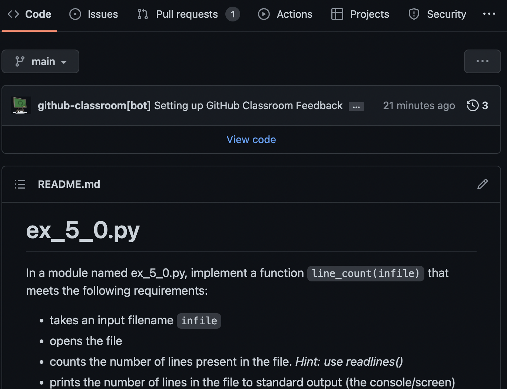

## Introduction

This reference is for students taking the course associated with this text. 
Assignments in the course will be submitted via GitHub Classroom.  This document links 
relevant supporting references from the 
[Git and GitHub Learning Resources](https://docs.github.com/en/get-started/quickstart/git-and-github-learning-resources) page.

## Create a GitHub Account
Students will need a GitHub account in order to complete assignments in the course. 
Assignment instructions, starter code, and supporting data are all available via a  
GitHub repository which is available to students once they accept the assignment 
invitation. Moreover, industry standard CI tools are used to grade student work. 

In order to access assignments, a GitHub account is needed. Note that there is *no 
requirement* that you use your university email address when signing up. You may even 
use an existing GitHub account. 

If you do not already have a GitHub account, sign up for one at 
[GitHub](https://www.github.com).

!!! info
    Visit the GitHub guide to [creating an account](https://docs.github.com/en/get-started/signing-up-for-github/signing-up-for-a-new-github-account) 

## Installing GitHub Desktop
Git is a version control system that tracks changes to text based files (like Python 
code) which are stored in a git repository (repo).  A repository is a directory that a 
git application watches for changes. Git provides:

- snapshots of changes / change sets
- the ability to merge several sets of changes
- the ability to roll back changes
- branching changes where a set of changes to a codebase can be developed separately 
  from the primary codebase. 
- both local and remote repository change syncing via commits (adding changes to 
  history), pushing (sending local changes to remote), and pulling (retrieving changes 
  from the remote). 

GitHub provides access to all of this functionality via the 
[GitHub Desktop App](https://desktop.github.com)

<figure markdown>

<figcaption>GitHub Desktop: Viewing file differences.</figcaption>
</figure>

!!! info
    Visit the GitHub guide to [Getting Started with GitHub Desktop](https://docs.github.com/en/desktop/installing-and-configuring-github-desktop/overview/getting-started-with-github-desktop)

## Accepting an Assignment
In order to begin working on an assignment, students must accept an assignment 
invitation link. The steps involved in accepting a link are as follows:

1. Click the invitation link. Your browser will open to a GitHub classroom assignment 
   page.
    <figure markdown>
    {width="300"}
    <figcaption>Select Yourself from the List</figcaption>
    </figure>
2. Next, select your name from the student identifier list to link your GitHub account 
   to the assignment.  This list should contain an entry that you can use to uniquely 
   identify yourself--Name, Username, and Email are present. *Note: If your name is 
   not present, select "skip to the next step" and inform your instructor that you 
   need to be added to the list.
3. The next screen that greets you is the *assignment acceptance screen*. Click 
   "Accept this Assignment".
    <figure markdown>
    {width="300"}
    <figcaption>Accept the Assignment</figcaption>
    </figure>
4. When you accept the assignment, a copy of the assignment repository is copied to 
   your account so that you can work with it. The screen that appears notes that you 
   need to refresh the page to get the link.  When you refresh the page, you'll be 
   greeted with a link. 
    <figure markdown>
    {width="300"}
    <figcaption>Repository Ready... click the link.</figcaption>
    </figure>
   
## Working on the Assignment
### Read the README.md
In order to begin working on the assignment, you'll first want to review the `README.
md` that you are greeted by when you first visit your repository. This will be present 
for every assignment and it provides detailed instructions and assignment requirements.

<figure markdown>
{width="300"}
<figcaption>Viewing the README</figcaption>
</figure>

### Clone your Repository
While it is possible to edit files using the GitHub web application, this is *not* a 
good idea for Python development.  The web editor does *not* have access to a shell 
for testing and it does not come with a debugger. 

The standard approach is to *clone* your repository. Cloning takes care of three 
essential tasks:

- copying the repository assets: source code, data files, tests, etc. 
- copying the git configuration (necessary for git to work with your repo)
- copying the repository history (necessary for tracking and updating)

Cloning can be accomplished by several methods:

- using GitHub desktop (recommended)
- using the command line (terminal) which requires that you have [Git for 
  Windows](https://git-scm.com/download/win) or if you are on macOS, [macOS XCode 
  command-line utilities](https://developer.apple.com/xcode/resources/). 
- using and IDE. PyCharm can directly open your GitHub repository for example.

!!! tip "Recommendation"
    Cloning your repo via GitHub Desktop is highly recommended when starting out. 
    Check out the GitHub [documentation on cloning](https://developer.apple.com/xcode/resources/).  

### Browse the Repository with File Explorer
Once you have cloned your repository, GitHub Desktop presents you with three options 
in the main application pane:

1. Open the repository in an IDE (Like PyCharm or VSCode)
2. Open the repository with a File Browser (Windows Explorer for example)
3. Open the repository on GitHub.  

For editing files locally, choose the 2nd option. 

### Edit Python Source Files
A template Python file is present for every sub-part of any assignment.  These files 
are located in the `src` directory of your repository. Use a file browser to navigate 
to the source directory.   

```text
.
├── README.md
├── requirements.txt
├── src     <---- Assignment templates are here
└── tests
```

Any text editor can be used to modify Python source code since Python modules are plain 
text files. It is better to use a Python-aware editor like the editor present in IDLE, 
PyCharm or VS Code.  

!!! danger
    When opening a Python module for editing, *always right-click and choose Open With.
..*. If you double-click a Python module, the operating system will run the file. 

### Commit Local Changes, Push to Submit to GitHub
When you make progress on your assignment, it is best to commit those changes. When 
you do this, you create a snapshot that can be restored if necessary. Once you have 
reached a milestone or completed your assignment it is time to push those changes to 
GitHub. 

!!! danger 
    You are encouraged to work only on the `main` branch for assignments in this 
    course. Assignment submissions must be committed to and pushed to the `main` branch. 

Reference the GitHub instructions on committing and pushing.

- [GitHub Reference: committing](https://docs.github.com/en/desktop/contributing-and-collaborating-using-github-desktop/making-changes-in-a-branch/committing-and-reviewing-changes-to-your-project)
- [GitHub Reference: pushing](https://docs.github.com/en/desktop/contributing-and-collaborating-using-github-desktop/making-changes-in-a-branch/pushing-changes-to-github)

### Viewing Auto-grading Results
When you make significant progress on your assignment, you'll likely want to know how 
you are doing.  Each time you push changes to GitHub, a CI pipeline runs checks on 
your code. These checks consist of:

- unit tests (written for [pytest](https://docs.pytest.org/en/6.2.x/contents.html))
  - these assure that your solutions meet the requirements and are used for autograding. 
- style checks (via [pytest-flake8](https://github.com/tholo/pytest-flake8))
  - style checks assure that your code style adheres to the subset of the [PEP8](https://peps.python.org/pep-0008/) style 
    guide adopted for the course.  

You can view the output of these tests via the GitHub classroom interface or within 
GitHub itself. If any checks fail, the log will help you determine the necessary fixes. 

Check out the documentation on [viewing auto-grading output](https://docs.github.com/en/education/manage-coursework-with-github-classroom/learn-with-github-classroom/view-autograding-results).

!!! note
    The same checks that are run when you push to GitHub can be run locally. To 
    accomplish this, pytest will need to be installed locally as well.  The easiest 
    way to assure that you have the appropriate tools in place to test is to install 
    the requirements listed in the `requirements.txt` file located in you repo. This 
    is the topic of another article.   

## Related Links
- [Configure Pycharm for GitHub](https://www.jetbrains.com/help/pycharm/github.html)
- [Configure VS Code for GitHub](https://vscode.github.com)


